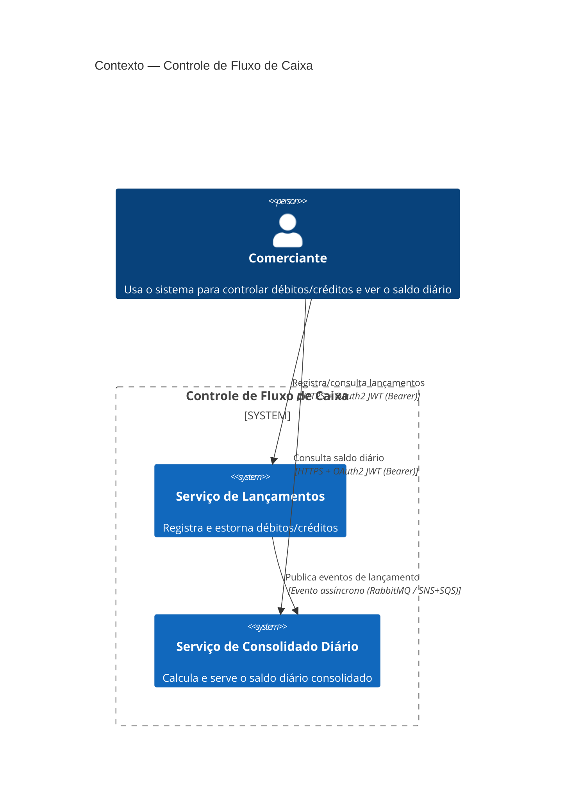

# Arquitetura Alvo — Controle de Fluxo de Caixa

**Consolida:** ADR-001 a ADR-007, `DESIGN/lancamentos/`, `DESIGN/consolidado-diario/`

## Diagrama de Contexto



## Visão de Infraestrutura e Topologia de Rede

### Segurança e borda (Ingress)

- O cliente autentica-se em um Provedor de Identidade (IdP) externo, que emite
  um token JWT.
- O token carrega `client_id` e, no MVP, também um `tenantId` lógico do
  comerciante/cliente. Esse identificador é usado para controle de tráfego,
  segmentação de acesso e isolamento lógico dos dados, mesmo com um único
  cliente ativo no escopo atual.
- As requisições REST autenticadas passam por firewall/WAF na borda e chegam a
  um Load Balancer ou API Gateway, que distribui o tráfego de forma balanceada
  para os serviços.
- O tráfego de entrada é validado pelo IdP e pela borda antes de permitir acesso
  aos endpoints de negócio.

### Decisão explícita sobre BFF

- O projeto não exige um BFF como requisito inicial. A camada de borda é
  representada por um API Gateway / Load Balancer, e esse padrão é o padrão
  recomendado para o MVP e para a arquitetura alvo deste desafio.
- O BFF é uma evolução opcional e deve ser introduzido somente quando houver
  múltiplos clientes com necessidades heterogêneas de contrato, payload,
  autenticação, autorização ou experiência de usuário.
- Em cenários com um único frontend ou com contratos de API padronizados,
  manter uma API de negócio direta por trás do gateway reduz complexidade,
  acelera entrega e preserva autonomia dos serviços.
- Se, no futuro, surgirem web/mobile/admin com regras diferentes de agregação,
  composição e segurança, o BFF pode ser adicionado como camada de adaptação
  de cliente, sem quebrar a arquitetura base já definida.

### Rede e isolamento

- Todo o ecossistema roda dentro de uma Virtual Private Cloud (VPC), em uma
  região específica.
- Os microsserviços Lançamentos e Consolidado Diário ficam em sub-redes privadas,
  isoladas por zona de disponibilidade (AZ-A e AZ-B), reduzindo o risco de falha
  em um único ponto.
- A comunicação entre cliente e serviços ocorre exclusivamente via ingress
  controlado; não há exposição direta de bancos ou broker para a internet.

### Mensageria (desacoplamento)

- A comunicação interna entre os microsserviços é mediada por um broker de
  mensagens seguindo o padrão assíncrono orientado a eventos.
- Para o PoC e ambiente local, o desenho usa RabbitMQ; para a referência em
  nuvem, a decisão mapeada é SNS + SQS (ADR-002 e ADR-003).
- Os eventos de domínio saem do serviço de Lançamentos e são consumidos de
  forma idempotente pelo Consolidado Diário.

### Persistência de dados (CQRS de infraestrutura)

- Cada serviço tem seu próprio banco PostgreSQL, conforme decisão do ADR-004.
- No desenho de alta disponibilidade, cada banco usa topologia primária/
  secundária dentro da própria zona de isolamento do serviço: o banco primário
  fica na AZ-A e a réplica de leitura fica na AZ-B.
- Todas as operações de escrita dos microsserviços são direcionadas ao banco
  primário da AZ-A.
- Todas as operações de leitura são roteadas para a réplica secundária da AZ-B,
  aliviando o banco transacional principal e melhorando a escala de leitura.
- Essa topologia é aplicada por serviço, não em um banco compartilhado entre
  Lançamentos e Consolidado Diário.

### Identidade do cliente e isolamento lógico

- O cliente representa um `tenantId` lógico para o contexto do comerciante, mesmo
  em um cenário de único cliente no MVP.
- O JWT emitido pelo IdP inclui claims como `sub`, `client_id`, `tenantId`,
  `aud`, `iss` e `exp`.
- Cada operação deve verificar o `tenantId` do token e enforçar que os dados e
  os eventos processados pertencem ao mesmo cliente. Isso garante isolamento
  lógico dos dados e permite expansão para multi-tenant sem quebrar o contrato.
- Nos bancos, o identificador do cliente pode ser persistido em cada tabela de
  domínio e consultado em todas as queries de leitura/escrita, ou em uma tabela
  de dados particionados por tenant, dependendo do volume e do desenho final.

## Diagrama de Contêineres

```mermaid
flowchart LR
    subgraph Cliente
        C[Comerciante / App Cliente]
    end

    subgraph "Edge / Ingress"
        IDP[IdP Externo<br/>OAuth2 / JWT]
        WAF[Firewall / WAF]
        LB[Load Balancer]
    end

    subgraph "VPC - Região"
        subgraph "SubNet Private - AZ-A"
            L_API[API REST - Spring Boot]
            L_DB[(PostgreSQL Primary)]
            L_OUT[Outbox Publisher]
        end

        subgraph "SubNet Private - AZ-B"
            S_API[API REST - Spring Boot]
            S_DB[(PostgreSQL Secondary / Read Replica)]
            S_CACHE[(Redis - cache dias fechados)]
            S_CONSUMER[Consumidor de Eventos<br/>(idempotente)]
        end

        MQ{{Broker Queue<br/>Amazon MQ / RabbitMQ}}
    end

    C -- "HTTPS + OAuth2 JWT (client_id + tenantId)" --> IDP
    IDP -- "token JWT" --> WAF
    WAF --> LB
    LB --> L_API
    LB --> S_API
    L_API --> L_DB
    L_API --> L_OUT
    L_OUT -- "publica evento com tenantId" --> MQ
    MQ -- "consome evento" --> S_CONSUMER
    S_CONSUMER --> S_DB
    S_API --> S_CACHE
    S_API --> S_DB
```

## Fluxo Ponta a Ponta — Registrar Lançamento até a Conciliação

```mermaid
sequenceDiagram
    autonumber
    participant Cliente
    participant IdP as IdP / Auth Server
    participant WAF as WAF / Firewall
    participant LB as Load Balancer
    participant LAPI as MS Lançamentos
    participant LDB as PostgreSQL Lançamentos
    participant O as Outbox
    participant MQ as Broker Queue
    participant CAPI as MS Consolidado Diário
    participant CDB as PostgreSQL Consolidado

    Cliente->>IdP: 1. autentica-se e obtém JWT
    IdP-->>Cliente: 2. access token
    Cliente->>WAF: 3. HTTPS + JWT
    WAF->>LB: 4. valida e encaminha requisição
    LB->>LAPI: 5. POST /lancamentos

    LAPI->>LAPI: 6. valida claims do token (tenantId, clientId, scope)
    LAPI->>LDB: 7. grava lançamento + chave de idempotência
    LAPI->>O: 8. registra evento de outbox na mesma transação
    LAPI-->>Cliente: 9. 201 Created

    O->>MQ: 10. publisher lê evento pendente e publica mensagem
    MQ-->>CAPI: 11. entrega evento de lançamento

    CAPI->>CAPI: 12. verifica eventId/idempotencyKey
    CAPI->>CDB: 13. valida tenantId e aplica regra de conciliação
    CAPI->>CDB: 14. atualiza saldo diário / upsert do dia

    Note over CAPI,CDB: 15. se o evento já foi processado, ignora duplicata
    Note over LAPI, CAPI: 16. os serviços continuam desacoplados; falha do consumidor não bloqueia a API
```

### Interpretação do fluxo

- O cliente nunca envia o identificador do usuário como dado de negócio confiável; o identificador vem do token JWT validado na borda e no serviço.
- O lançamento e o evento de outbox são persistidos na mesma transação para evitar o dual write.
- O publisher assíncrono envia a mensagem para a fila, e o consumidor idempotente aplica a conciliação do saldo.
- Se o mesmo evento chegar mais de uma vez, a chave de idempotência evita reprocessamento duplicado.
- O resultado final é a conta financeira consistente, mesmo com comunicação assíncrona e falhas transitórias.

### Regra contábil do estorno aplicada no fluxo

- O estorno não usa valor negativo.
- O novo lançamento de estorno é gravado com **valor positivo** e **tipo invertido**
  em relação ao original.
- O Consolidado Diário interpreta esse evento como reversão contábil do impacto
  financeiro do lançamento anterior, mantendo a consistência do saldo diário.

## Decisões-chave (rastreabilidade para os ADRs)

| Preocupação arquitetural | Decisão | ADR |
|---|---|---|
| Padrão arquitetural | Serviços desacoplados + eventos assíncronos | ADR-001 |
| Mensageria | RabbitMQ local / SNS+SQS produção | ADR-002 |
| Provedor de nuvem | AWS | ADR-003 |
| Persistência | PostgreSQL, banco por serviço | ADR-004 |
| Consistência entre serviços | Transactional Outbox + Idempotent Consumer | ADR-005 |
| Escalabilidade/resiliência (50 rps) | Cache diferenciado por status do dia + rate limiting + escalonamento horizontal | ADR-006 |
| Segurança de acesso | OAuth2/JWT com Authorization Server | ADR-007 |

## Requisitos Não-Funcionais → como são atendidos

- **NFR01 (isolamento de falha)**: nenhuma chamada síncrona entre serviços
  (ADR-001); Consolidado Diário fora do ar não afeta Lançamentos.
- **NFR02 (50 rps, ≤5% perda)**: cache-aside + rate limiting + escalonamento
  horizontal (ADR-006).
- **NFR03 (escalabilidade horizontal)**: serviços stateless em containers,
  ECS Fargate + Auto Scaling em produção (ADR-003).
- **NFR04 (segurança de acesso)**: OAuth2/JWT + TLS (ADR-007).
- **NFR05 (consistência/auditabilidade)**: lançamentos imutáveis, correção via
  estorno com valor positivo e sentido contábil invertido (Domain Design de
  Lançamentos e projeção do Consolidado Diário).
- **NFR06 (observabilidade)**: ver `ARCHITECTURE/observabilidade.md`.
- **NFR07 (testabilidade)**: testes unitários de regras de cálculo + testes de
  integração com Testcontainers.
- **NFR08 (documentação)**: este repositório (`aidlc-docs/`, `DESIGN/`,
  `ARCHITECTURE/`).

## Evoluções futuras (fora do escopo do MVP, documentadas por transparência)

- Multi-tenant (múltiplos comerciantes) com Unit de Identidade/Acesso dedicada
  e OAuth2 (ver ADR-007).
- Exportação de relatórios (CSV/PDF) e integração contábil externa (US09).
- Migrar publicação de eventos de outbox-poller para CDC (Debezium) se o
  volume de escrita crescer (ADR-005).
- Multi-moeda (hoje fixo em BRL — Value Object `Money` já isola essa decisão).
